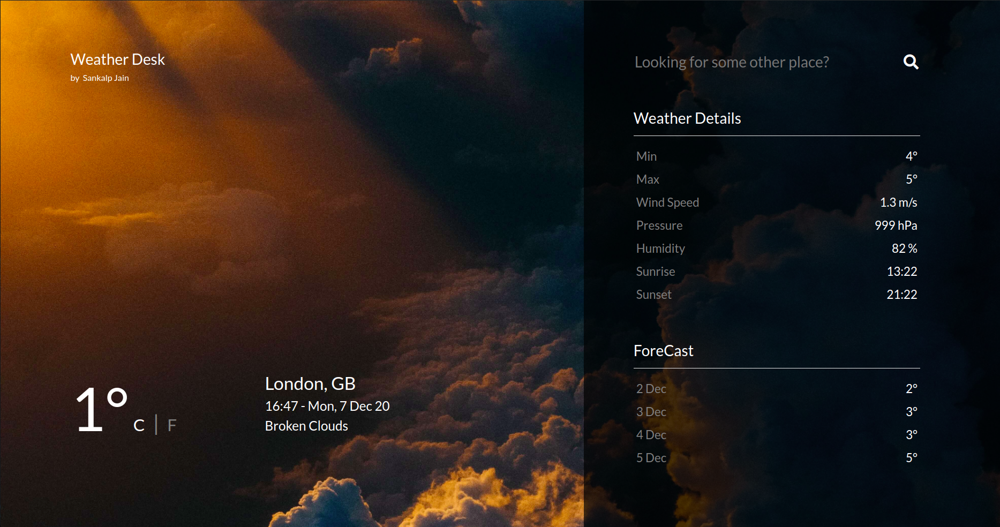

# Weather Desk

Weather Desk is your all-in-one solution for your weather needs. Be it your local temperature or some place you fancy, Weather Desk got you covered!

## API Details

openweathermap.org 5 day/3 hour forecast API was used to fetch data. [Click here for more details](https://openweathermap.org/forecast5)

## Details Shown

1. Feels Like Temperature (C/F)
2. Min Temperature
3. Max Temperature
4. Wind Speed in m/s
5. Pressure in hPa
6. Humidity
7. Sunrise and Sunset Timings (in IST)
8. Temperature Forecast for the next 4 days
9. Current Date and Time

## Technologies Used

1. HTML
2. CSS
3. BootStrap
4. JavaScript
5. JQuery

## Image Credits

1. [ThunderStorm Image](https://unsplash.com/photos/QO4Y97jiVDQ?utm_source=unsplash&utm_medium=referral&utm_content=creditShareLink)

2. [Drizzle Image](https://unsplash.com/photos/mG8tIl03jSM?utm_source=unsplash&utm_medium=referral&utm_content=creditShareLink)

3. [Rain Image](https://unsplash.com/photos/5t4isI9DNzc?utm_source=unsplash&utm_medium=referral&utm_content=creditShareLink)

4. [Snow Image](https://unsplash.com/photos/ytYc8VkMVL0?utm_source=unsplash&utm_medium=referral&utm_content=creditShareLink)

5. [Clear Image](https://unsplash.com/photos/sYffw0LNr7s?utm_source=unsplash&utm_medium=referral&utm_content=creditShareLink)

6. [Cloudy Image](https://unsplash.com/photos/hgGplX3PFBg?utm_source=unsplash&utm_medium=referral&utm_content=creditShareLink)

7. [Dust Image](https://unsplash.com/photos/TwFlpM77wiQ?utm_source=unsplash&utm_medium=referral&utm_content=creditShareLink)

8. [Sand Image](https://unsplash.com/photos/4cloovdyuvw?utm_source=unsplash&utm_medium=referral&utm_content=creditShareLink)

9. [Mist Image](https://unsplash.com/photos/PDfe7H5GJR0?utm_source=unsplash&utm_medium=referral&utm_content=creditShareLink)

10. [Tornado Image](https://unsplash.com/photos/n_3kdpSkrJo?utm_source=unsplash&utm_medium=referral&utm_content=creditShareLink)